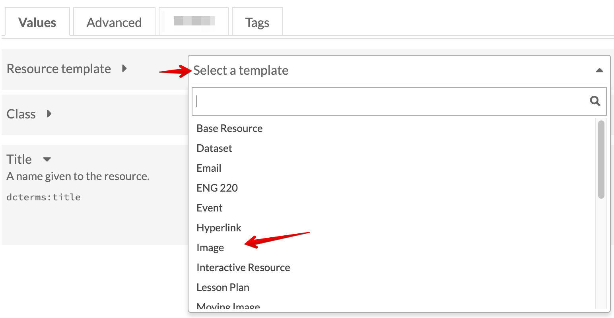
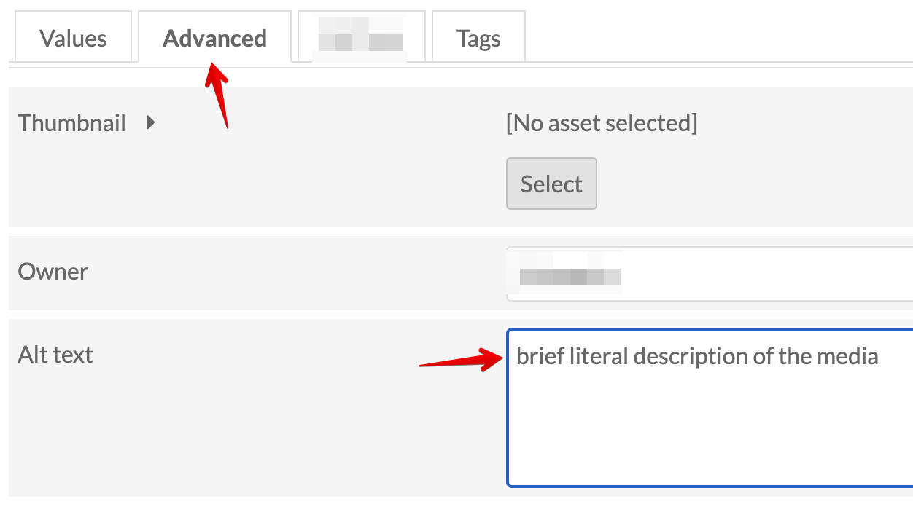

# Add Media with Alt Text
<!-- no toc -->
This page goes through the process of adding media and its alt text to items.

## Table of Contents

- [Add Media](#add-media)
- [Select Media Template](#select-media-template)
- [Add Alt Text to Media](#add-alt-text-to-media)
- [Find Alt Text Examples on Web](#find-alt-text-examples-on-web)

### Add Media

From the item page, select the Media tab. Click Upload under Add media on the right, give the media a Title (I used the same item title), choose the file and select Save. You can also link to media hosted elsewhere, but that runs the risk of that media getting moved or removed.

### Select Media Template

Since only the media's title is added when you upload, you should provide a little more information for the media itself. This is related to, but distinct from the item metadata. Most media will be either image or text.

If you'd like to add a description, dates, or other metadata to the media, do so now. This is especially important when there are multiple media for a single item, e.g., different photographs, text announcement of the building opening, scan of a newspaper clipping about the opening ceremony.

### Add Alt Text to Media

While you're adding metadata to the media, copy/paste or create your own alternative text for the media. Select the Advanced tab and fill in the alt text in the Alt text field. Follow [WebAIM](https://webaim.org/techniques/alttext/#context) for good practices of alt text. Remove any "image of" or "graphic of" in the field. [WebAIM suggests](https://webaim.org/techniques/alttext/#context) removing these phrases from images. This adds to the richness of metadata and allows increased accessibility.

### Find Alt Text Examples on Web

You can see what alt text other provide on most websites. Check the browser developer tools to find the alt text.

*Dev Tools for Alt Text*
