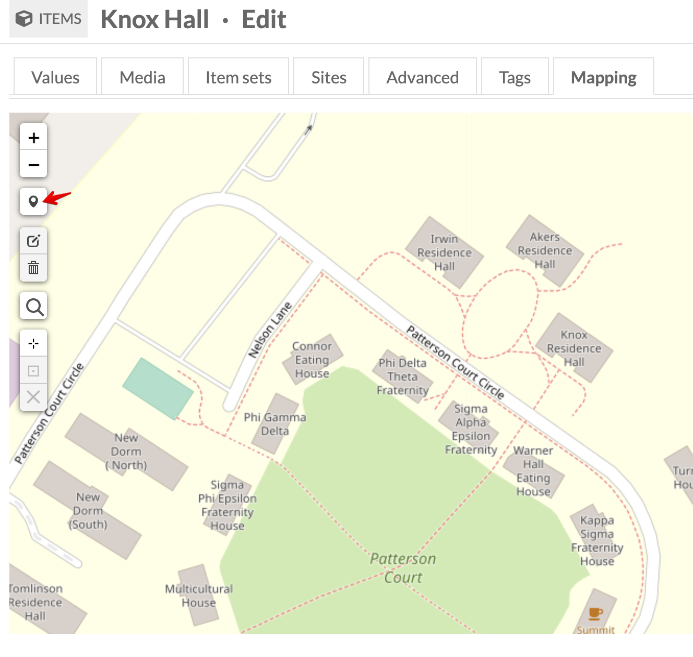

# Add Physical Objects: Items and Pages
<!-- no toc -->
## Davidson Context
<!-- no toc -->
This page is intended to give step-by-step instructions on adding items to Omeka S that are primarily buildings or locations on or near campus.

## TL;DR
<!-- no toc -->

- Add/create item using the physical object template with title, description, and date.
- Add all media and accompanying media metadata: title, description (used for alt-text), and date (used for mapping timeline).
- Add mapping marker for the item.
- Add item to page.

## Overview of process

- [Add New Item](#add-new-item)
  - [Physical Object Resource Template](#physical-object-resource-template)
  - [Add Media](#add-media)
  - [Add Media Description](#add-media-description)
  - [Find Alt Text](#find-alt-text)
  - [Add Item to Item Set](#add-item-to-item-set)
  - [Remove Sites from Item](#remove-sites-from-item)
  - [Mapping for Locations and Buildings](#mapping-for-locations-and-buildings)
- [Add Physical Object to Page](#add-physical-object-to-page)
  - [Copy Text to HTML Blocks](#copy-text-to-html-blocks)
  - [Add Media Embed Block](#add-media-embed-block)
  - [Mapping Block](#mapping-block)
- [Save and View each page for consistency and accessibility](#save-and-view-each-page-for-consistency-and-accessibility)

### Add New Item

Under Resources on the left panel, select Items then click the Add new item button near the top-right corner.

*Resources > Items Menu*
*Add New Item*

#### Physical Object Resource Template

From the **Resource Template** dropdown **select Physical Object** (e.g., campus building). This will add Dublin Core elements to fill in. Since most sites we're building/migrating from aren't rich in metadata, fill in as many as you can, but certainly the following three elements: **Title, Description, and Date**.

I gathered the metadata in the image below from the following sources: image file name, hover-over text and paragraph text from original encyclopedia page, and alt-text via Dev Tools, if available

If the item you're adding is a building, select the Physical Object Resource Template. The [Numeric Data Types Module](https://omeka.org/s/modules/NumericDataTypes/) and [Mapping Module](https://github.com/omeka-s-modules/Mapping) are integrated with this template/class and the Date field.

*Physical Object Resource Template for Buildings*

Instead of a text field for the date, **select Add value** and enter the date info you have. This will allow the addition of a timeline on the mapping block on pages. Even if the timeline function won't be used in the Mapping block on a page, this field for date is appropriate.

*Numeric Data Date Field*

#### Add Media

Select the Media tab, click Upload under Add media on the right, give the media a Title (I used the same item title), choose file and select Save.

*Upload or Link Media*

#### Add Media Description

Media descriptions are used for the alt text. Follow [WebAIM](https://webaim.org/techniques/alttext/#context) for media descriptions. Remove any "image of" or "graphic of" in the media description. [WebAIM suggests](https://webaim.org/techniques/alttext/#context) removing these phrases from images.

There's an alt text tab but there's a [Alt Text Module](https://github.com/zerocrates/AltText) where the alt text is pulled from the Media dc:description field by default. This adds to the richness of metadata and allows increased accessibility.

*Edit Media Description*

#### Find Alt Text

If there isn't alt-text apparent or there are multiple media for a single item and therefore the item description isn't helpful, check the browser developer tools to find the alt text.

*Dev Tools for Alt Text*

#### Add Item to Item Set

In the case the physical object is part of a set of similar items, e.g., Campus Buildings, adding the item to an Item Set allows for easier queries for timelines and maps (see more info below).

Click on the **Item Sets** tab, search the Item Set name, select it, and move on.

#### Remove Sites from Item

Remove any sites from the Item's **Sites tab** that you don't want the item to appear in via the browse function on the front end.

*Remove Sites*

#### Mapping for Locations and Buildings

Since you're adding an item that has a location, e.g., campus building, add data to the **Mapping** tab. This is enabled by installing the [Mapping Module](https://github.com/omeka-s-modules/Mapping). Documentation can be found on the [Omeka S Docs site](https://omeka.org/s/docs/user-manual/modules/mapping/).

*Mapping Tab in Item*

On the Mapping tab, zoom into the location on the map. I used the [custom Google Maps](https://www.google.com/maps/d/u/0/viewer?msa=0&hl=en&ie=UTF8&t=h&ll=35.50058299999999%2C-80.842356&spn=0.005241%2C0.00751&z=17&source=embed&mid=1vWP_iahd5am7_7S615B97tZK0zE) by Archives Special Collections and Community to find locations I was unfamiliar with.

*Add Point Button*

Click on the map to place the marker.

*Place Marker*

Click on the marker to add an image.

*Select Marker Image*

**Click Save** to complete the Item!

### Add Physical Object to Page

Now that the item has been created, you can now build the page to display the item/media, text, map, and possibly timeline.

#### Copy Text to HTML Blocks

Copy the text from the HTML/WP site, either in the HTML view or public view. **Add new HTML block** and **paste** the text. Use **Heading 3** `<h3>` since `<h1>` (site title) and `<h2>` (page title) are already used.

*Add HTML Block*

#### Add Media Embed Block

**Add Media Embed block** and **change Alignment** to **center**, **left**, or **right**, depending on the look and feel.

*Embed Media Block*

**Add attachment** (quick add item on right panel) and **click Apply changes**

*Add Item to Media Embed Block*

*Media Embed Apply Changes*

#### Mapping Block

Since you're working with campus buildings, they should be the Physical Object class that integrates with the [Numeric Data Type Module](https://omeka.org/s/modules/NumericDataTypes/), particularily the Date Value.

*Numeric Data Date Field*

With the mapping data and Numeric Data Type Date added to the **item**, you can display both the physical map and a timeline using the Mapping Block (attachment or query).

*Mapping Block Example*

Below is what just the mapping block looks like on a page, without the timeline.

*Mapping Block without Timeline*

Below is what the mapping block looks like with the timeline property enabled.

*Map and Timeline View on Public Site*

### Save and View each page for consistency and accessibility

**Click Save** then **View** to see what the public view looks like. You may need to adjust the alignment, but **medium** and **left/right** for the media embed seems to do best as "center" doesn't look all that great.

Run a [WAVE test](https://wave.webaim.org/) to check for missing alt text, or other accessibility errors. If you have 0 errors, "check mark" the appropriate columns in the GSheet tracker.

*Wave Test*
