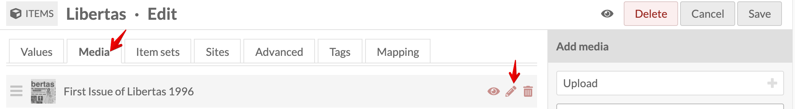

# Migrate a Webpage from HTML/WordPress to Omeka S
<!-- no toc -->
## Davidson Context
<!-- no toc -->
This page is intended to give guidance on migrating static HTML sites or WordPress sites to an Omeka S site. Many of the examples are from the ASCC Encyclopedia Migration Project

## Overview of process

- [Create Site in Omeka S](#create-site-in-omeka-s)
- [Download images from HTML site and back up in Google Drive folder](#download-images-from-html-site-and-back-up-in-google-drive-folder)
- [Create an item in Omeka S for each image with media](#create-an-item-in-omeka-s-for-each-image-with-media)
  - [Add New Item](#add-new-item)
  - [Select Resource Template](#select-resource-template)
  - [Person/Agent Linked Data](#personagent-linked-data)
  - [Add Media](#add-media)
  - [Add Media Description](#add-media-description)
  - [Find Alt Text](#find-alt-text)
  - [Remove Sites from Item](#remove-sites-from-item)
  - [Mapping for Locations and Buildings](#mapping-for-locations-and-buildings)
- [Create pages in Omeka mirroring the pages or headings in HTML site depending on the structure](#create-pages-in-omeka-mirroring-the-pages-or-headings-in-html-site-depending-on-the-structure)
- [Add blocks to each Omeka S page, e.g., HTML and Media Embed to mirror the structure of original HTML site](#add-blocks-to-each-omeka-s-page-eg-html-and-media-embed-to-mirror-the-structure-of-original-html-site)
- [Save and View each page for consistency and accessibility](#save-and-view-each-page-for-consistency-and-accessibility)

___

### Create Site in Omeka S

[COMING SOON]

### Download images from HTML site and back up in Google Drive folder

[COMING SOON]

### Create an item in Omeka S for each image with media

#### Add New Item

Under Resources on the left panel, select Items then click the Add new item button near the top-right corner.

*Resources > Items Menu*
*Add New Item*

#### Select Resource Template

From the **Resource Template** dropdown **select** the appropriate template, e.g., **Image** (scanned photo), **Text** (letter), **Physical Object** (building), **Person/Agent** (person) depending on the item. This will add Dublin Core element fields to fill in. Since most sites we're building/migrating from aren't rich in metadata, fill in as many as you can, but certainly the following three elements: **Title, Description, and Date**. If available, put the Record Group #, e.g., 9-0431, 29-0056, in the Identifier field.

#### Person/Agent Linked Data

If the item is a person, search [Library of Congress Name Authority File (LCNAF)](https://id.loc.gov/authorities/names.html), [Wikidata](https://www.wikidata.org/wiki/Wikidata:Main_Page), and [VIAF](https://viaf.org/) to add a URI to the item record in Omeka S.
If they are in any of the locations above (LCNAF, Wikidata, or VIAF), add each URI as an identifier in the Omeka S item record.

I gathered the metadata in the image below from the following sources: image file name, hover-over text and paragraph text from original encyclopedia page, and alt-text via Dev Tools, if available

*Fill out Item Metadata*

#### Add Media

Select the Media tab, click Upload under Add media on the right, give the media a Title (I used the same item title), choose file and select Save.

*Upload or Link Media*

#### Add Media Description

Media descriptions are used for the alt text. **Copy** the **Item Description** to paste into the **Media Description**. Follow [WebAIM](https://webaim.org/techniques/alttext/#context) for media descriptions to edit the media description to match good practices for alt text. Remove any "image of" or "graphic of" in the description. [WebAIM suggests](https://webaim.org/techniques/alttext/#context) removing these phrases from images.

There's an alt text tab but there's a [Alt Text Module](https://github.com/zerocrates/AltText) where the alt text is pulled from the Media dc:description field by default. This adds to the richness of metadata and allows increased accessibility.

*Copy Item Description*

*Edit Media*

*Paste Item Desc. into Media Desc.*

#### Find Alt Text

If there isn't alt-text apparent or there are multiple media for an item and therefore doesn't have a description, check the browser developer tools to find the alt text.

*Dev Tools for Alt Text*

#### Remove Sites from Item

Remove any sites you from the **Sites tab** that you don't to appear in via the browse function on the front end.

*Remove Sites*

#### Mapping for Locations and Buildings

If you're adding an item that is a location, e.g., campus building, add data to the **Mapping** tab.

*Mapping Tab in Item*

Zoom into the location on the map. I used the [custom Google Maps](https://www.google.com/maps/d/u/0/viewer?msa=0&hl=en&ie=UTF8&t=h&ll=35.50058299999999%2C-80.842356&spn=0.005241%2C0.00751&z=17&source=embed&mid=1vWP_iahd5am7_7S615B97tZK0zE) by Archives Special Collections and Community.

*Add Point Button*

Click on the map to place the marker.

*Place Marker*

Click on the marker to add an image.

*Select Marker Image*

**Click Save** to complete the Item!

### Create pages in Omeka mirroring the pages or headings in HTML site depending on the structure

### Add blocks to each Omeka S page, e.g., HTML and Media Embed to mirror the structure of original HTML site

### Save and View each page for consistency and accessibility
