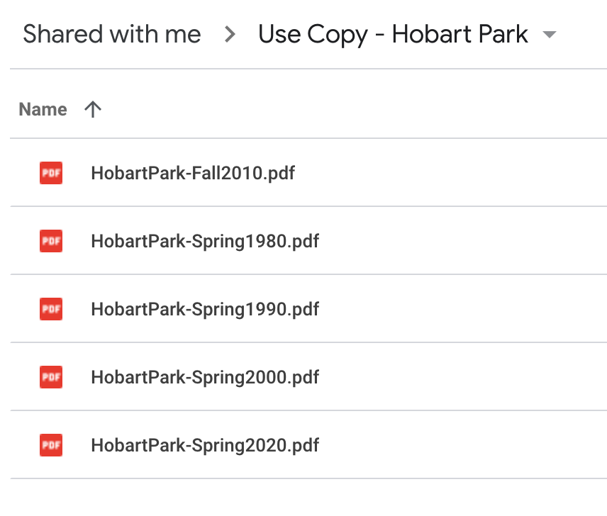
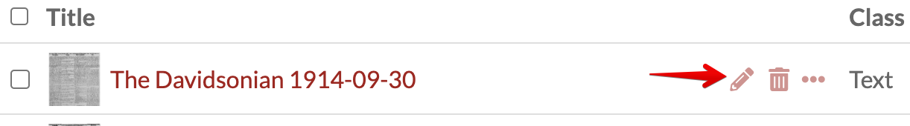
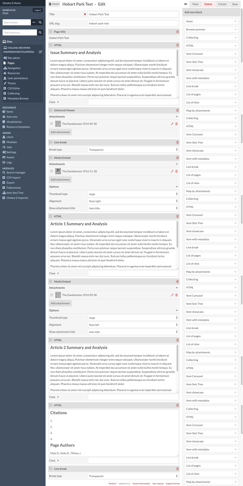
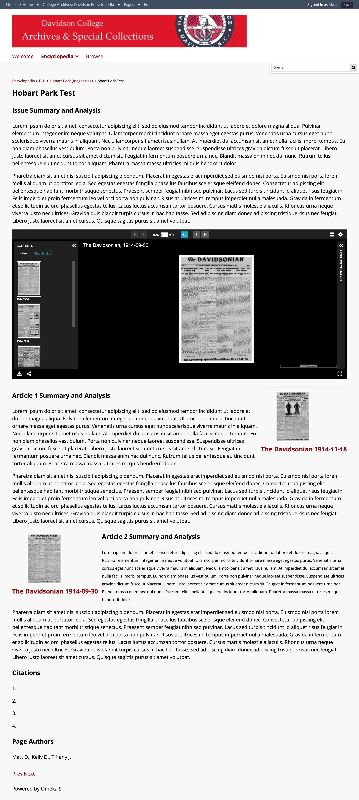
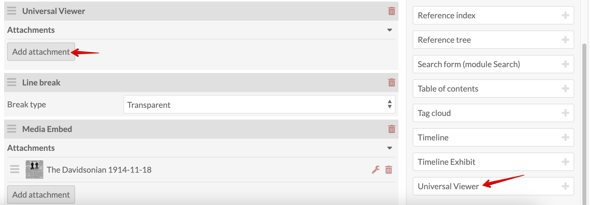
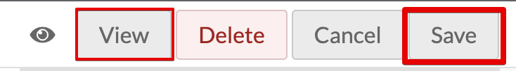

# Omeka S Documentation for ENG 220: Literary Analysis
<!-- no toc -->
## Davidson Context
<!-- no toc -->
This page is intended to give guidance on adding items and creating pages for the group project in ENG 220: Literary Analysis at Davidson College.

## Overview of Process

- [Create an Item in Omeka S](#create-an-item-in-omeka-s)
  - [Add New Item](#add-new-item)
  - [Select Resource Template](#select-resource-template)
  - [Add Media](#add-media)
  - [Add Media Description](#add-media-description)
- [Page Setup in Omeka S](#page-setup-in-omeka-s)
  - [Details for Adding Content to Pages](#details-for-adding-content-to-pages)
- [How to Build Pages](#how-to-build-pages)
  - [Type Text in HTML Blocks](#type-text-in-html-blocks)
  - [Add Universal Viewer Block for Issue](#add-universal-viewer-block-for-issue)
  - [Add Media Embed Block](#add-media-embed-block)
  - [Save and View each page for consistency and accessibility](#save-and-view-each-page-for-consistency-and-accessibility)

### Create an Item in Omeka S

#### Add New Item

Under Resources on the left panel, select Items then click the Add new item button near the top-right corner.

*Resources > Items Menu*

*Add New Item*

#### Select Resource Template

From the **Resource Template** dropdown **select "ENG 220"**. This will add Dublin Core element fields to fill in. Fill in all required fields.

I gathered the metadata about the issue from the pdf in Google Drive.

**Click "Add"** to save the Item's metadata before adding the media.

**Click the pencil icon** to edit the item to add media.

#### Add Media

Select the Media tab, click Upload under Add media on the right, give the media a Title (I used the same item title), choose file and select Save.

*Upload Media*

#### Add Media Description

Media descriptions are used for the alt text. Follow [WebAIM](https://webaim.org/techniques/alttext/#context) for media descriptions to edit the media description to match good practices for alt text. Remove any "image of" or "graphic of" in the description. [WebAIM suggests](https://webaim.org/techniques/alttext/#context) removing these phrases from images.

*Edit Media*

*Type Media Desc.*

There's an alt text tab but there's a [Alt Text Module](https://github.com/zerocrates/AltText) where the alt text is pulled from the Media dc:description field by default. This adds to the richness of metadata and allows increased accessibility.

**Be as descriptive as you can with the media description, but be concise.**

### Page Setup in Omeka S

The items and media are ready to be contextualized and embedded into pages, which are used as "exhibits" or as more typical web pages.

#### Details for Adding Content to Pages

There are pages for each issue for group. Below are two screenshots to provide an overview snapshot, including **HTML Blocks** and **Media Embed Blocks**

*Page Layout Example*

The image above :point_up: is a snapshot of what each group's page should look like, which includes the following:

1. HTML block as intro text/context
2. Universal Viewer with the issue media
3. Line Break
4. Media Embed block of first entry/article
5. Text analyzing the first entry/article
6. Media Embed block of second entry/article
7. Text analyzing the second entry/article
8. HTML block including any Citations and your names (Firstname LastInitial., e.g., Matt D.)

Below :point_down: is what it looks like in the public view.

*Layout Public View*

### How to Build Pages

Details on adding Blocks to Omeka S pages.

#### Type Text in HTML Blocks

**Add HTML block** and **type** the text in the HTML Block. If there's a heading, use **Heading 3** `<h3>` since Heading 1 `<h1>` (site title) and Heading 2 `<h2>` (page title) are already used.

*Add HTML Block*

#### Add Universal Viewer Block for Issue

**Add Universal View block** at the bottom of the blocks panel on the right, then **select Add attachement**.

**Add attachment** (search and select the item on right panel) and **click Apply changes**

*Add Item to Universal Viewer Block*

*Apply Changes*

#### Add Media Embed Block

**Add Media Embed block** and **change Alignment** to **left** or **right**, depending on the look and feel.

*Embed Media Block*

**Add attachment** (search and select the item on right panel) and **click Apply changes**

*Add Item to Media Embed Block*

*Media Embed Apply Changes*

#### Save and View each page for consistency and accessibility

**Click Save** then **View** to see what the public view looks like. You may need to adjust the alignment, but **medium** and **left/right** for the media embed seems to do best as "center" doesn't look all that great.

Run a [WAVE test](https://wave.webaim.org/) to check for missing alt text, or other accessibility errors. Make sure you have 0 errors.

*Wave Test*
