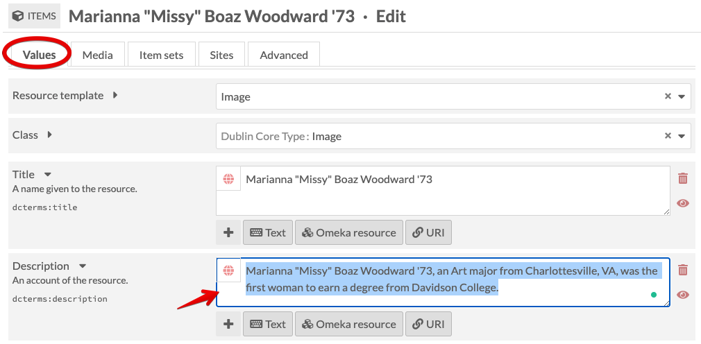
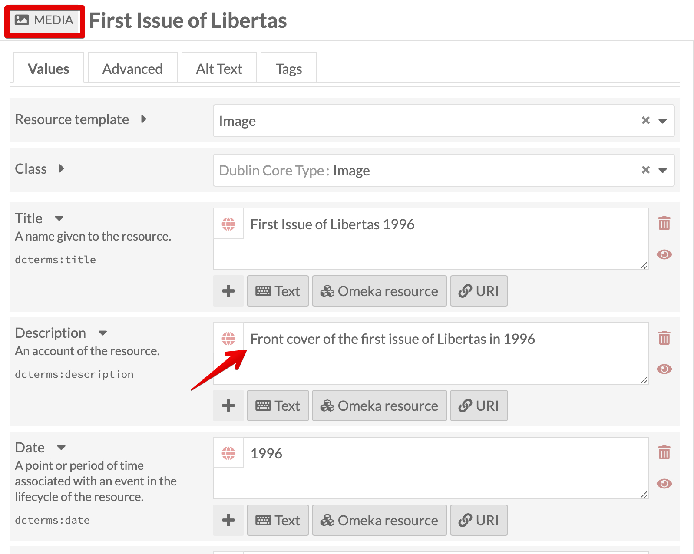
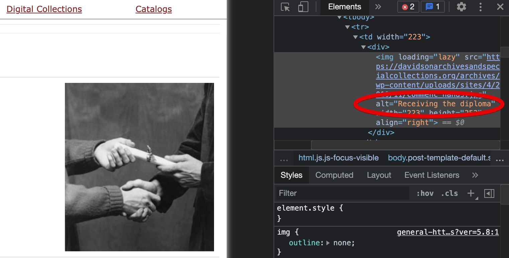
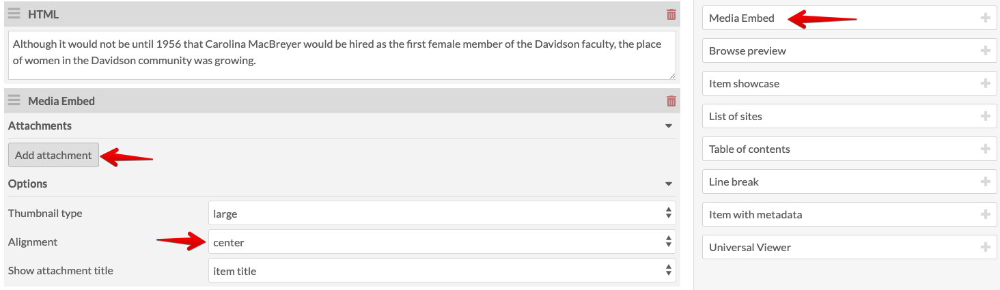
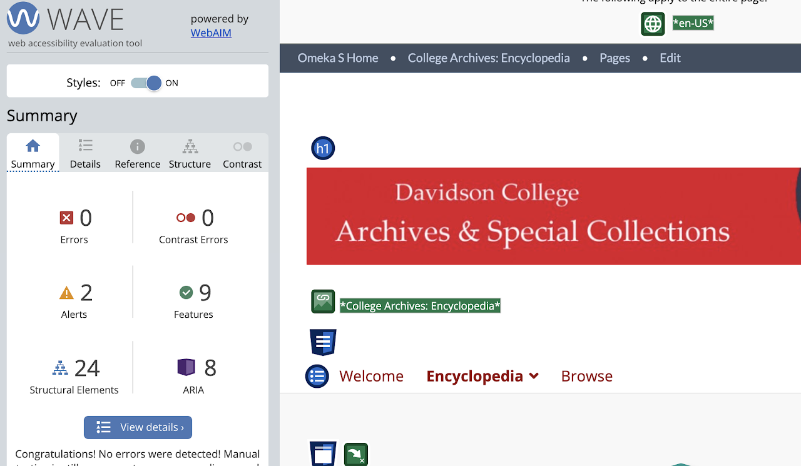

# Omeka S Documentation for ENG 422: Creating Narratives
<!-- no toc -->
## Davidson Context
<!-- no toc -->
This page is intended to give guidance on adding items and creating pages for the group project in ENG 422: Creating Narratives at Davidson College.

## Overview of Process

- [Create an item in Omeka S for each image with media](#create-an-item-in-omeka-s-for-each-image-with-media)
  - [Add New Item](#add-new-item)
  - [Select Resource Template](#select-resource-template)
  - [Add Media](#add-media)
  - [Add Media Description](#add-media-description)
  - [Find Alt Text](#find-alt-text)
  - [Mapping for Locations and Buildings](#mapping-for-locations-and-buildings)
- [Page Setup in Omeka S](#page-setup-in-omeka-s)
  - [Add New Page](#add-new-page)
  - [New Page Setup](#new-page-setup)
  - [Details for Adding Content to Pages](#details-for-adding-content-to-pages)
- [How to Build Pages](#how-to-build-pages)
  - [Type Text in HTML Blocks](#type-text-in-html-blocks)
  - [Add Media Embed Block](#add-media-embed-block)
  - [Mapping Block](#mapping-block)
  - [Save and View each page for consistency and accessibility](#save-and-view-each-page-for-consistency-and-accessibility)

### Create an item in Omeka S for each image with media

#### Add New Item

Under Resources on the left panel, select Items then click the Add new item button near the top-right corner.

*Resources > Items Menu*

*Add New Item*

#### Select Resource Template

From the **Resource Template** dropdown **select** the appropriate template, e.g., **Image** (scanned photo), **Text** (letter), **Physical Object** (building), **Person/Agent** (person) depending on the item. This will add Dublin Core element fields to fill in. Since most sites we're building/migrating from aren't rich in metadata, fill in as many as you can, but certainly the following three elements: **Title, Description, and Date**.

I gathered the metadata in the image below from the following sources: image file name, hover-over text and paragraph text from original encyclopedia page, and alt-text via Dev Tools, if available

*Fill out Item Metadata*

#### Add Media

Select the Media tab, click Upload under Add media on the right, give the media a Title (I used the same item title), choose file and select Save.

*Upload or Link Media*

#### Add Media Description

Media descriptions are used for the alt text. **Copy** the **Item Description** to paste into the **Media Description**. Follow [WebAIM](https://webaim.org/techniques/alttext/#context) for media descriptions to edit the media description to match good practices for alt text. Remove any "image of" or "graphic of" in the description. [WebAIM suggests](https://webaim.org/techniques/alttext/#context) removing these phrases from images.

There's an alt text tab but there's a [Alt Text Module](https://github.com/zerocrates/AltText) where the alt text is pulled from the Media dc:description field by default. This adds to the richness of metadata and allows increased accessibility.

*Copy Item Description*

*Edit Media*

*Paste Item Desc. into Media Desc.*

#### Find Alt Text

If there isn't alt-text apparent or there are multiple media for an item and therefore doesn't have a description, check the browser developer tools to find the alt text.

*Dev Tools for Alt Text*

#### Mapping for Locations and Buildings

If you're adding an item that has a location, e.g., campus building, add data to the **Mapping** tab. Follow the [instructions on my other Omeka S documentaion.](https://github.com/Davidson-Library/Omeka-S/blob/main/Migrate_to_Omeka_S.md#mapping-for-locations-and-buildings)

### Page Setup in Omeka S

The initial goal is to mirror the pages, headings, and media from the original site depending on the structure. The items and media are ready to be contextualized and embedded into pages, which are used as "exhibits" or more typical web pages.

#### Add New Page

Once the site has been created, **click on Pages** on the left panel and the **Add new page** button near the top right.

*Pages Menu*

*Add New Page*

#### New Page Setup

Add all info for the new page, including a **Title** and **Slug**. Depending on the page, **check the box next** to **Add to navigation**. Then **click Add**.

*New Page Setup*

#### Details for Adding Content to Pages

Now that the page has been created under the site, you can start adding content. Below are two screenshots to provide an overview snapshot, including **HTML Blocks** and **Media Embed Blocks**

*Page Layout Example*

The image above :point_up:  is a snapshot of what a typical page looks like: HTML block as intro text/context, and the Media Embed block.

Below :point_down: is what it looks like in the public view.

*Layout Public View*

### How to Build Pages

Details on adding Blocks to Omeka S pages.

#### Type Text in HTML Blocks

**Add HTML block** and **type** the text in the HTML Block. If there's a heading, use **Heading 3** `<h3>` since Heading 1 `<h1>` (site title) and Heading 2 `<h2>` (page title) are already used.

*Add HTML Block*

#### Add Media Embed Block

**Add Media Embed block** and **change Alignment** to **center**, **left**, or **right**, depending on the look and feel.

*Embed Media Block*

**Add attachment** (quick add item on right panel) and **click Apply changes**

*Add Item to Media Embed Block*

*Media Embed Apply Changes*

#### Mapping Block

If you're working with campus buildings, follow the [instructions on my other page for the Mapping Block](https://github.com/Davidson-Library/Omeka-S/blob/main/Migrate_to_Omeka_S.md#mapping-block) on pages.

#### Save and View each page for consistency and accessibility

**Click Save** then **View** to see what the public view looks like. You may need to adjust the alignment, but **medium** and **left/right** for the media embed seems to do best as "center" doesn't look all that great.

Run a [WAVE test](https://wave.webaim.org/) to check for missing alt text, or other accessibility errors. Make sure you have 0 errors.

*Wave Test*
