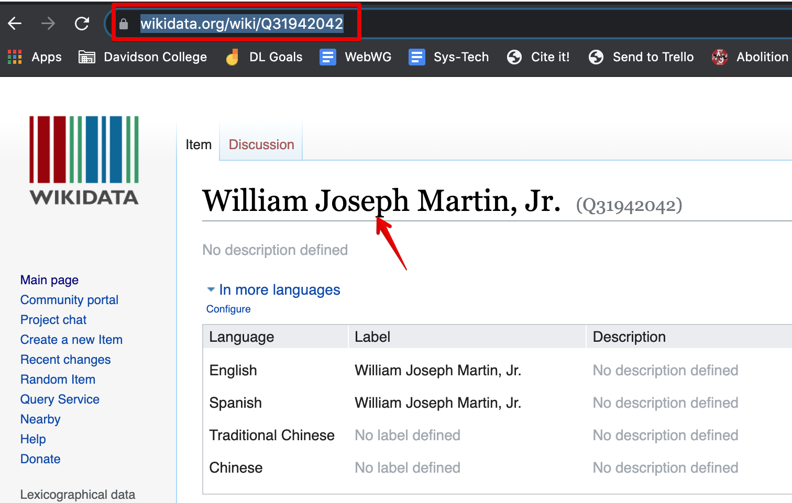
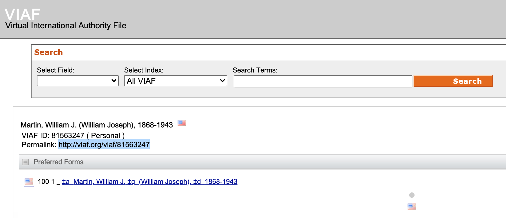
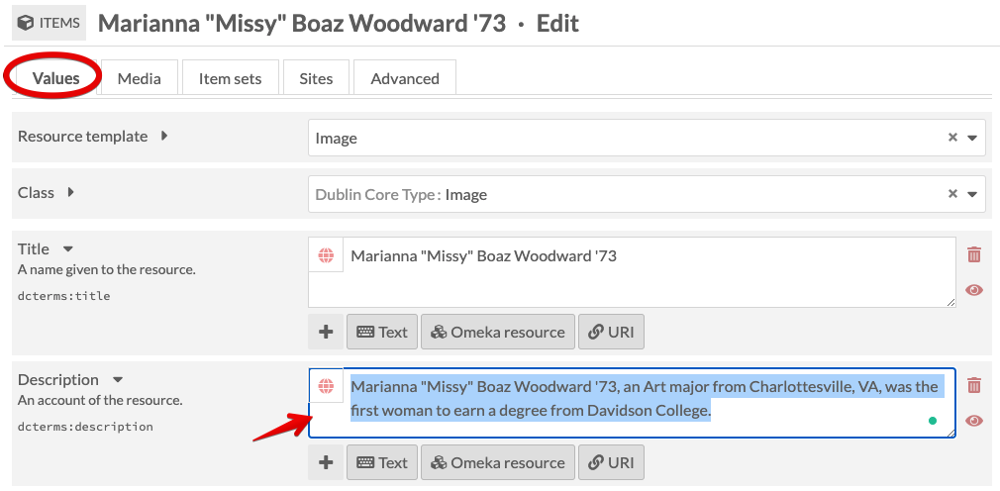
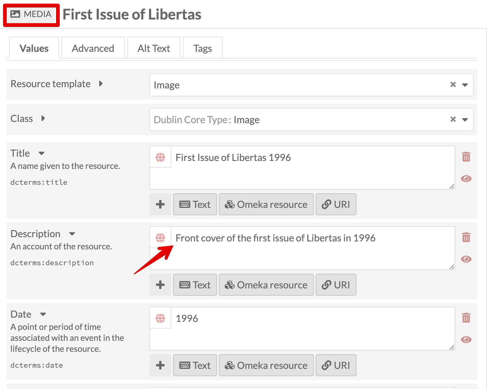
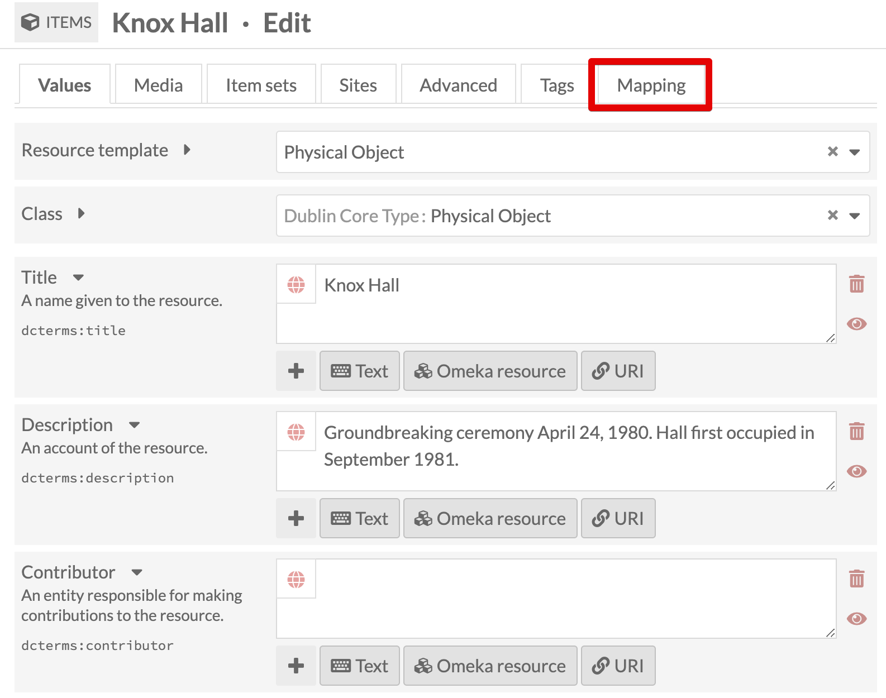
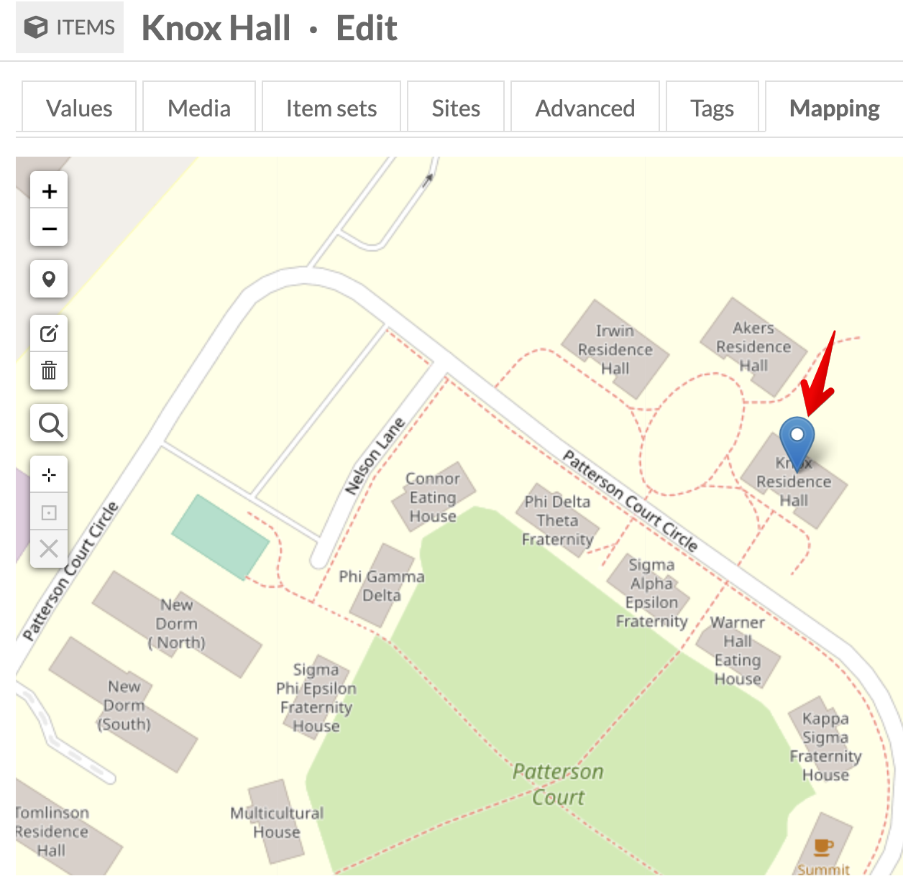
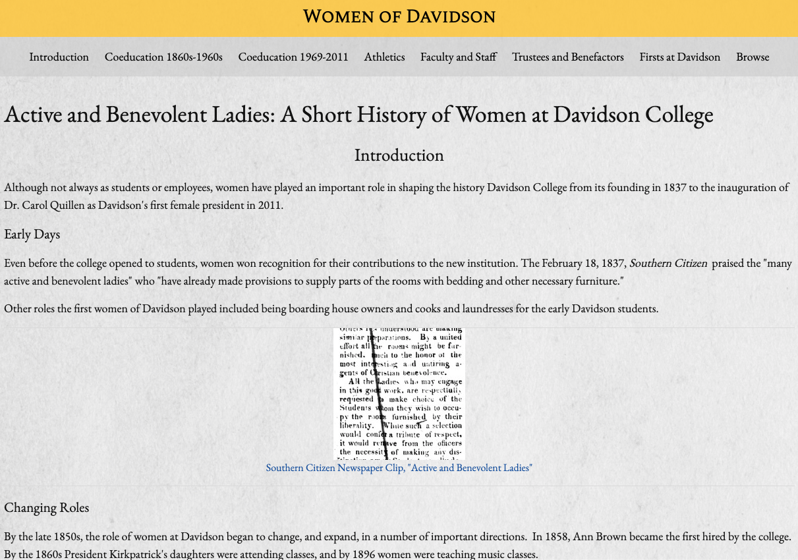
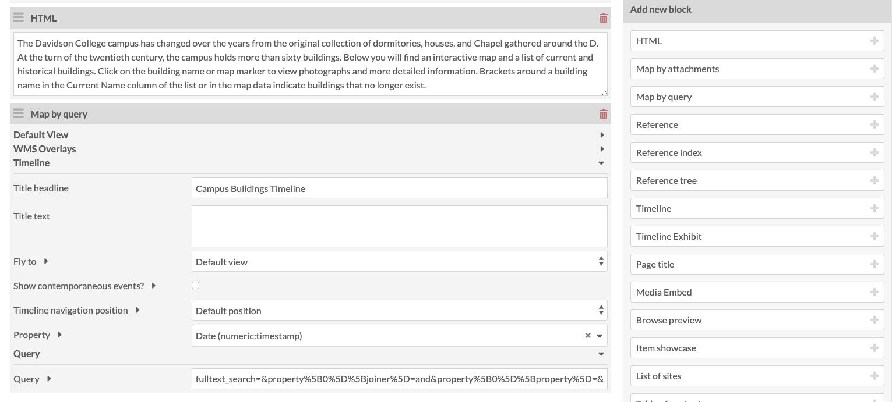
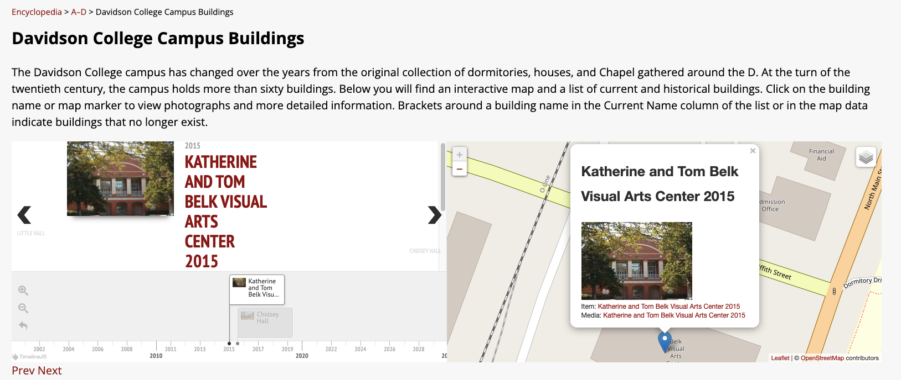
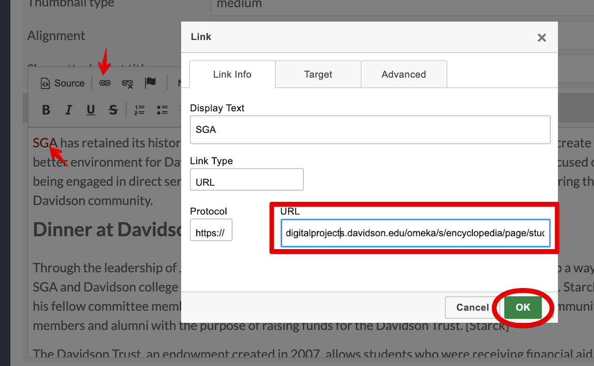

# Migrate a Webpage from HTML/WordPress to Omeka S
<!-- no toc -->
## Davidson Context
<!-- no toc -->
This page was started with a migration project in mind. It intended to give guidance on migrating static HTML sites or WordPress sites to an Omeka S site. Many of the examples are from the ASCC Encyclopedia Migration Project. It has slowly developed into the main Omeka S documentation for the Davidson College Library.

## Overview of Process

- [Create Site in Omeka S](#create-site-in-omeka-s)
- [Download images from HTML site and back up in Google Drive folder](#download-images-from-html-site-and-back-up-in-google-drive-folder)
- [Create an item in Omeka S with media](#create-an-item-in-omeka-s-with-media)
  - [Add New Item](#add-new-item)
  - [Select Resource Template](#select-resource-template)
  - [Building/Physical Object](#buildingphysical-object)
  - [Person/Agent Linked Data](#personagent-linked-data)
  - [Add Media](#add-media)
  - [Add Media Description](#add-media-description)
  - [Find Alt Text](#find-alt-text)
  - [Remove Sites from Item](#remove-sites-from-item)
  - [Mapping for Locations and Buildings](#mapping-for-locations-and-buildings)
- [Page Setup in Omeka S](#page-setup-in-omeka-s)
  - [Add New Page](#add-new-page)
  - [New Page Setup](#new-page-setup)
  - [Details for Adding Content to Pages](#details-for-adding-content-to-pages)
- [How to Build Pages](#how-to-build-pages)
  - [Copy Text to HTML Blocks](#copy-text-to-html-blocks)
  - [Add Media Embed Block](#add-media-embed-block)
  - [Mapping Block](#mapping-block)
    - [Map Only](#map-only)
  - [Works Cited HTML Block](#works-cited-html-block)
  - [Save and View each page for consistency and accessibility](#save-and-view-each-page-for-consistency-and-accessibility)

___

### Create Site in Omeka S

[COMING SOON]

### Download images from HTML site and back up in Google Drive folder

[COMING SOON]

### Create an item in Omeka S with media

#### Add New Item

Under Resources on the left panel, select Items then click the Add new item button near the top-right corner.

*Resources > Items Menu*

*Add New Item*

#### Select Resource Template

From the **Resource Template** dropdown **select** the appropriate template, e.g., **Image** (scanned photo), **Text** (letter), **Physical Object** (building), **Person/Agent** (person) depending on the item. This will add Dublin Core element fields to fill in. Since most sites we're building/migrating from aren't rich in metadata, fill in as many as you can, but certainly the following four elements: **Title, Description, Creator, and Date**. If available, put the Record Group #, e.g., 9-0431, 29-0056, in the Identifier field.

I gathered the metadata in the image below from the following sources: image file name, hover-over text and paragraph text from original encyclopedia page, and alt-text via Dev Tools, if available. Title, Description, Creator, and Date should be added to every item.

*Fill out Item Metadata*

#### Building/Physical Object

If the item you're adding is a building, select the Physical Object Resource Template. The [Numeric Data Types Module](https://omeka.org/s/modules/NumericDataTypes/) and [Mapping Module](https://github.com/omeka-s-modules/Mapping) are integrated with this template/class and the Date field.

*Physical Object Resource Template for Buildings*

Instead of a text field for the date, **select Add value** and enter the date info you have. This will allow the addition of a timeline on the mapping module block on pages.

*Numeric Data Date Field*

See the [Mapping for Locations and Buildings](#mapping-for-locations-and-buildings) section for more details on item metadata.

#### Person/Agent Linked Data

If the item is a person, search [Library of Congress Name Authority File (LCNAF)](https://id.loc.gov/authorities/names.html), [Wikidata](https://www.wikidata.org/wiki/Wikidata:Main_Page), and [VIAF](https://viaf.org/) to add a URI to the item record in Omeka S.
If they are in any of the locations above (LCNAF, Wikidata, or VIAF), add each URI as an identifier in the Omeka S item record.

*Wikidata*

*VIAF*

*LCNAF*

These three URI in the dc:identifier field should look like the image below.

*Identifier URIs*

#### Add Media

Select the Media tab, click Upload under Add media on the right, give the media a Title (I used the same item title), choose file and select Save.

*Upload or Link Media*

#### Add Media Description

Media descriptions are used for the alt text. **Copy** the **Item Description** to paste into the **Media Description**. Follow [WebAIM](https://webaim.org/techniques/alttext/#context) for media descriptions to edit the media description to match good practices for alt text. Remove any "image of" or "graphic of" in the description. [WebAIM suggests](https://webaim.org/techniques/alttext/#context) removing these phrases from images.

There's an alt text tab but there's a [Alt Text Module](https://github.com/zerocrates/AltText) where the alt text is pulled from the Media dc:description field by default. This adds to the richness of metadata and allows increased accessibility.

*Copy Item Description*

*Edit Media*

*Paste Item Desc. into Media Desc.*

#### Find Alt Text

If there isn't alt-text apparent or there are multiple media for an item and therefore doesn't have a description, check the browser developer tools to find the alt text.

*Dev Tools for Alt Text*

#### Remove Sites from Item

Remove any sites you from the **Sites tab** that you don't to appear in via the browse function on the front end.

*Remove Sites*

#### Mapping for Locations and Buildings

If you're adding an item that is a location, e.g., campus building, add data to the **Mapping** tab. This is enabled by installing the [Mapping Module](https://github.com/omeka-s-modules/Mapping). Documentation can be found on the [Omeka S Docs site](https://omeka.org/s/docs/user-manual/modules/mapping/).

*Mapping Tab in Item*

Zoom into the location on the map. I used the [custom Google Maps](https://www.google.com/maps/d/u/0/viewer?msa=0&hl=en&ie=UTF8&t=h&ll=35.50058299999999%2C-80.842356&spn=0.005241%2C0.00751&z=17&source=embed&mid=1vWP_iahd5am7_7S615B97tZK0zE) by Archives Special Collections and Community to find locations I was unfamiliar with.

*Add Point Button*

Click on the map to place the marker.

*Place Marker*

Click on the marker to add an image.

*Select Marker Image*

**Click Save** to complete the Item!

### Page Setup in Omeka S

The initial goal is to mirror the pages, headings, and media from the original site depending on the structure. The items and media are ready to be contextualized and embedded into pages, which are used as "exhibits" or more typical web pages.

#### Add New Page

Once the site has been created, **click on Pages** on the left panel and the **Add new page** button near the top right.

*Pages Menu*

*Add New Page*

#### New Page Setup

Add all info for the new page, including a **Title** and **Slug**. Depending on the page, **check the box next** to **Add to navigation**. Then **click Add**.

*New Page Setup*

#### Details for Adding Content to Pages

Now that the page has been created under the site, you can start adding content to mirror the original HTML/WP site. Below are two screenshots to provide an overview snapshot, including **HTML Blocks** and **Media Embed Blocks**

*Page Layout Example*

The image above :point_up:  is a snapshot of what a typical page looks like: HTML block as intro text/context, and the Media Embed block.

Below :point_down: is what it looks like in the public view.

*Layout Public View*

### How to Build Pages

Add Blocks to each Omeka S page, e.g., HTML and Media Embed to mirror the structure of original HTML site

#### Copy Text to HTML Blocks

Copy the text from the HTML/WP site, either in the HTML view or public view. **Add new HTML block** and **paste** the text/code. If there's a heading, use **Heading 3** `<h3>` since `<h1>` (site title) and `<h2>` (page title) are already used.

*Add HTML Block*

#### Add Media Embed Block

**Add Media Embed block** and **change Alignment** to **center**, **left**, or **right**, depending on the look and feel.

*Embed Media Block*

**Add attachment** (quick add item on right panel) and **click Apply changes**

*Add Item to Media Embed Block*

*Media Embed Apply Changes*

#### Mapping Block

If you're working with campus buildings, they should use the Physical Object class that is integrated with the [Numeric Data Type Module](https://omeka.org/s/modules/NumericDataTypes/), particularily the Date Value. If you're using just the map and no timeline (single building), then skip to [Map Only](#map-only)

*Numeric Data Date Field*

With the Mapping data and Numeric Data Type Date data added to the **item**, you can display both the physical map and a timeline using the Mapping Block (attachment or query).

*Mapping Block Example*

If the items have the Physical Obejct Template/Class with the Numeric Value Date, Mapping data, and are part of the query (if using), then both the map and timeline will display on the page.

*Map and Timeline View on Public Site*

##### Map Only

If you're only adding a mapping block on a page with a single location, then read on. Add the "Map by attachments" block to the page and "Add attachment"

Search for, select, and apply changes for the item you want to attach to the mapping block. Once you see the thumbnail appear as the attachment, **Save** the page and view.

#### Works Cited HTML Block

Make sure to copy over the **Works Cited** section of the original page (if included) with **Works Cited** as a **Header 3**.

*Works Cited Heading HTML Block*

Update any hyperlinks and URLs from the original site to the new Omeka S page.

*Update the URL*

#### Save and View each page for consistency and accessibility

**Click Save** then **View** to see what the public view looks like. You may need to adjust the alignment, but **medium** and **left/right** for the media embed seems to do best as "center" doesn't look all that great.

Run a [WAVE test](https://wave.webaim.org/) to check for missing alt text, or other accessibility errors. If you have 0 errors, "check mark" the appropriate columns in the GSheet tracker.

*Wave Test*
