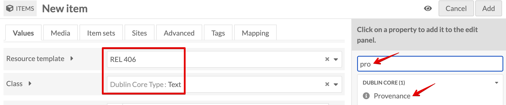
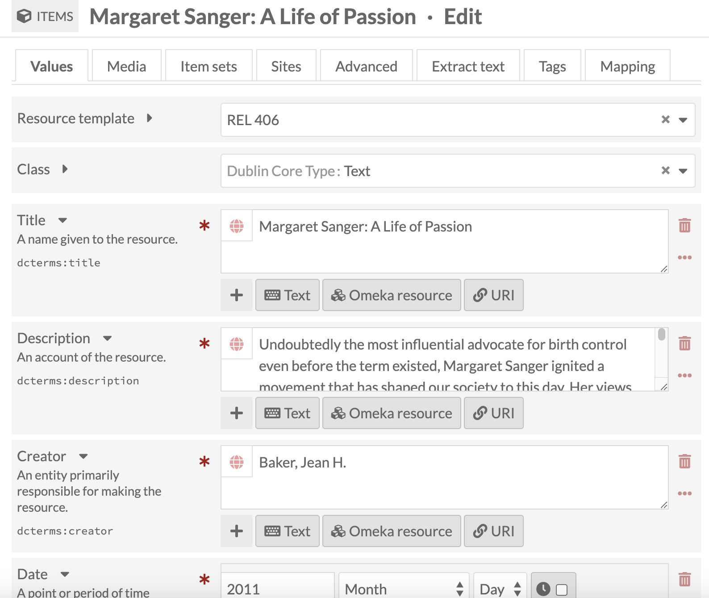
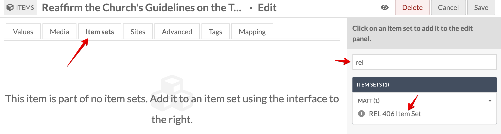

# Create an item in Omeka S with media

## Table of Contents

- [Add New Item](#add-new-item)
- [Select Resource Template](#select-resource-template)
- [Fill in Fields](#fill-in-fields)
- [Add Item to Item Set](#add-item-to-item-set)

### Add New Item

Under Resources on the left panel, select Items then click the Add new item button near the top-right corner.

  
*Resources > Items Menu*

  
*Add New Item*

### Select Resource Template

The **REL 406** Resource template will be selected by default. Stick with this. If you need to add fields, you can do so on the right panel.

  
*Add New Item for REL 406*

### Fill in Fields

Copy/Paste from your Google Docs if you already have this complete. Fill in as many fields as possible and save your item often. You can always go back and edit it. The Omeka folks have a great page for [Working with Dublin Core.](https://omeka.org/classic/docs/Content/Working_with_Dublin_Core/) It's on their Omeka Classic site, but it applies to Omeka S, too.

  
*Filled out Item Metadata*

### Add Item to Item Set

To help organize the items added to the course site, you're going to assign each item to the REL 406 Item Set. Adding the item to an Item Set allows for easier search queries, timelines, and maps (see more info below).

Click on the **Item Sets** tab, search the Item Set name, select it, and move on.

Now that you have an item created, it's time to add [Media with alt text.](Add_Alt_Text_Media.md)
