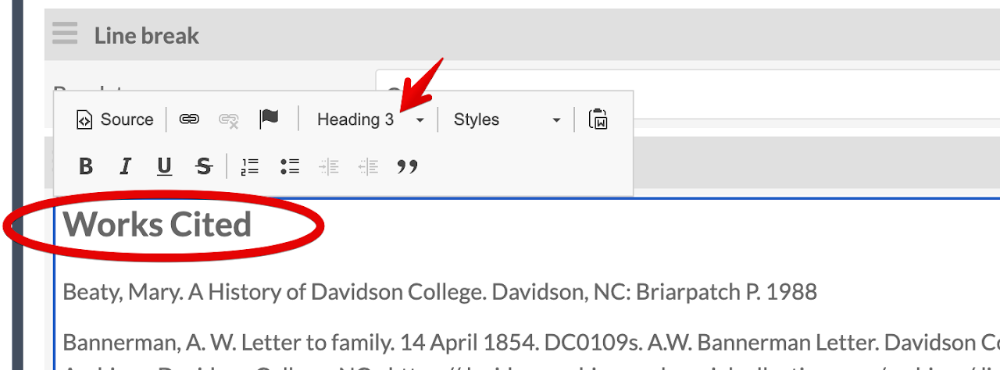

#### New Page Setup

Add all info for the new page, including a **Title** and **Slug**. Depending on the page, **check the box next** to **Add to navigation**. Then **click Add**.

*New Page Setup*

#### Details for Adding Content to Pages

Now that the page has been created under the site, you can start adding content to mirror the original HTML/WP site. Below are two screenshots to provide an overview snapshot, including **HTML Blocks** and **Media Embed Blocks**

*Page Layout Example*

The image above :point_up:  is a snapshot of what a typical page looks like: HTML block as intro text/context, and the Media Embed block.

Below :point_down: is what it looks like in the public view.

*Layout Public View*

### How to Build Pages

Add Blocks to each Omeka S page, e.g., HTML and Media Embed to mirror the structure of original HTML site

#### Copy Text to HTML Blocks

Copy the text from the HTML/WP site, either in the HTML view or public view. **Add new HTML block** and **paste** the text/code. If there's a heading, use **Heading 3** `<h3>` since `<h1>` (site title) and `<h2>` (page title) are already used.

*Add HTML Block*

#### Add Media Embed Block

**Add Media Embed block** and **change Alignment** to **center**, **left**, or **right**, depending on the look and feel.

*Embed Media Block*

**Add attachment** (quick add item on right panel) and **click Apply changes**

*Add Item to Media Embed Block*

*Media Embed Apply Changes*

#### Works Cited HTML Block

Make sure to copy over the **Works Cited** section of the original page (if included) with **Works Cited** as a **Header 3**.

*Works Cited Heading HTML Block*

Footnotes in Omeka S Video:

[Add Footnotes Video](https://drive.google.com/file/d/13DELkRQsVRbf_vdH3_KZqJKV4R2OJEA-/view)

#### Save and View each page for consistency and accessibility

**Click Save** then **View** to see what the public view looks like. You may need to adjust the alignment, but **medium** and **left/right** for the media embed seems to do best as "center" doesn't look all that great.

Run a [WAVE test](https://wave.webaim.org/) to check for missing alt text, or other accessibility errors. If you have 0 errors, "check mark" the appropriate columns in the GSheet tracker.

*Wave Test*
