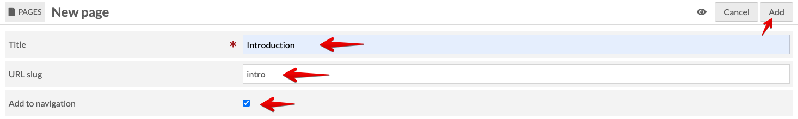
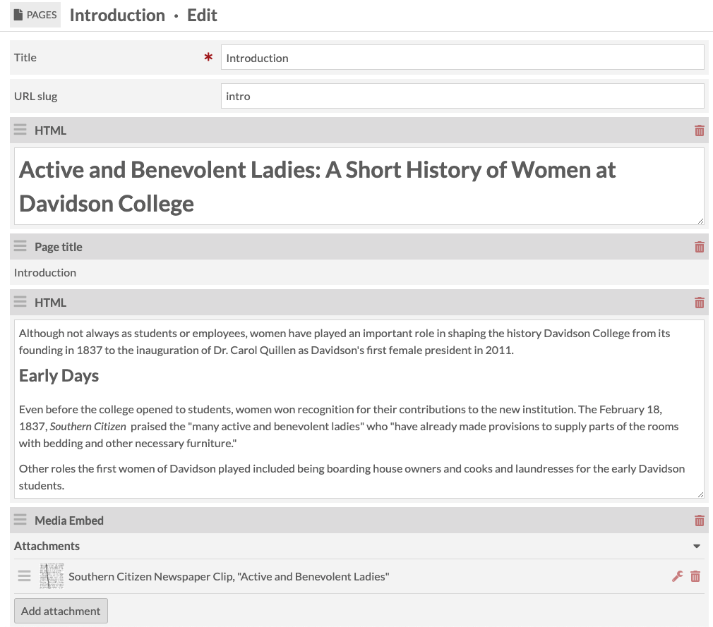

# Build Your Page/Exhibit

This page goes through the process of adding your items to a page, which will function as your exhibit.

## Table of Contents

- [New Page Setup](#new-page-setup)
  - [Details for Adding Content to Pages](#details-for-adding-content-to-pages)
- [How to Build Pages](#how-to-build-pages)
  - [Copy Text to HTML Blocks](#copy-text-to-html-blocks)
  - [Add Media Embed Block](#add-media-embed-block)
  - [Works Cited/Bibliography HTML Block](#works-citedbibliography-html-block)
  - [Save and View each page for consistency and accessibility](#save-and-view-each-page-for-consistency-and-accessibility)

### New Page Setup

Add all info for the new page, including a **Title** and **Slug**. Depending on the page, **check the box next** to **Add to navigation**. Then **click Add**.

*New Page Setup*

#### Details for Adding Content to Pages

Now that the page has been created under the site, you can start adding content. Below are two screenshots to provide an overview snapshot, including **HTML Blocks** and **Media Embed Blocks**

*Page Layout Example*

The image above :point_up:  is a snapshot of what a typical page looks like: HTML block as intro text/context, and the Media Embed block.

Below :point_down: is what it looks like in the public view.

*Layout Public View*

### How to Build Pages

Add Blocks to each Omeka S page, e.g., HTML and Media Embed to mirror the structure of original HTML site

#### Copy Text to HTML Blocks

Copy the text from the your source, e.g., Google Docs. **Add new HTML block** and **paste** the text/code. Make sure to copy without formatting as hidden formatting code pastes over from Google Docs.
`Ctrl+Shift+V` (PC) or `Cmd+Shift+V` (Mac)

If there's a heading, use **Heading 3** `<h3>` since `<h1>` (site title) and `<h2>` (page title) are already used.

*Add HTML Block*

#### Add Media Embed Block

**Add Media Embed block** and **change Alignment** to **center**, **left**, or **right**, depending on the look and feel. The media will embed (left or right alignment) with the Block (HTML Block) below the media.

*Embed Media Block*

**Add attachment** (quick add item on right panel) and **click Apply changes**

*Add Item to Media Embed Block*

*Media Embed Apply Changes*

Continue adding your items/media with media embed blocks and your text with HTML. If you'd like to experiement with other blocks go ahead and play. I'm happy to meet with anyone that's interested in using another block, e.g., Timeline or Map.

#### Works Cited/Bibliography HTML Block

Make sure to add a **Works Cited** or **Bibliography** section to your exhibit, using **Header 3**.

*Works Cited Heading HTML Block*

I've created a 2-minute video on adding footnotes to your exhibit:

[Add Footnotes Video](https://drive.google.com/file/d/13DELkRQsVRbf_vdH3_KZqJKV4R2OJEA-/view)

#### Save and View each page for consistency and accessibility

**Click Save** then **View** to see what the public view looks like. You may need to adjust the alignment, but **medium** and **left/right** for the media embed seems to do best as "center" doesn't look all that great, but this depends on what look you're going for.

Run a [WAVE test](https://wave.webaim.org/) to check for missing alt text, or other accessibility errors. If you have 0 errors, "check mark" the appropriate columns in the GSheet tracker.

*Wave Test*
