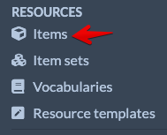
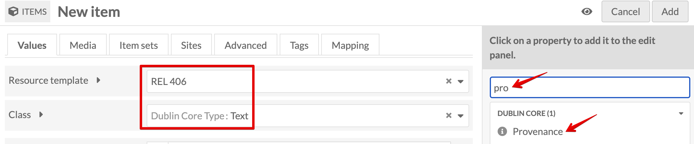

# Create an item in Omeka S with media

## Table of Contents

- [Add New Item](#add-new-item)
- [Select Resource Template](#select-resource-template)

### Add New Item

Under Resources on the left panel, select Items then click the Add new item button near the top-right corner.

*Resources > Items Menu*

*Add New Item*

### Select Resource Template

The **REL 406** Resource template will be selected by default. Stick with this. If you need to add fields, you can do so on the right panel.

*Add New Item for REL 406*

*Filled out Item Metadata*

Now that you have an item created, it's time to add [Media with alt text.](Add_Alt_Text_Media.md)
