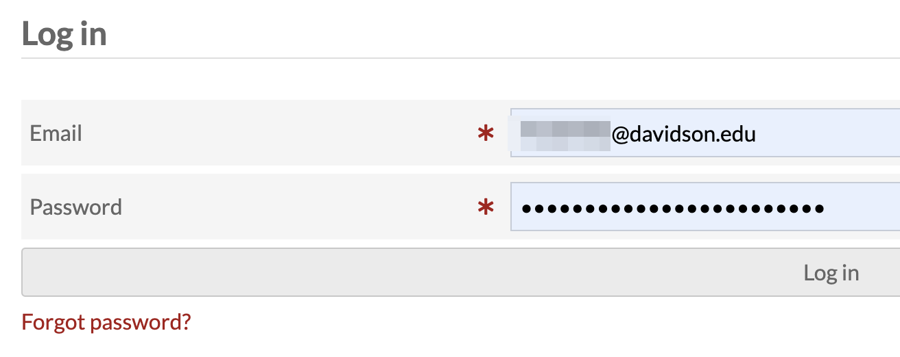
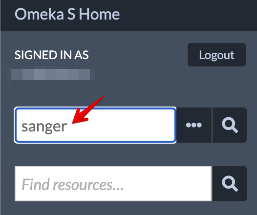
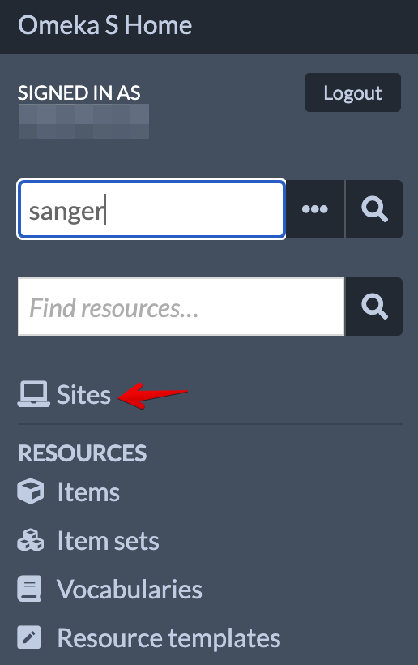
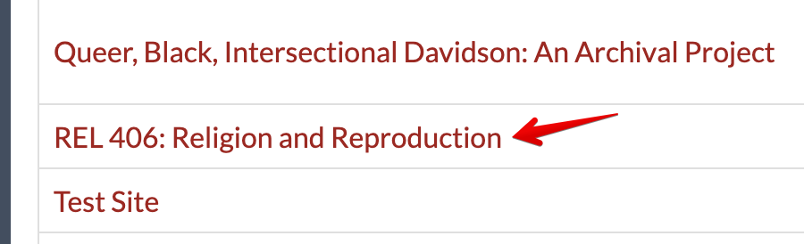
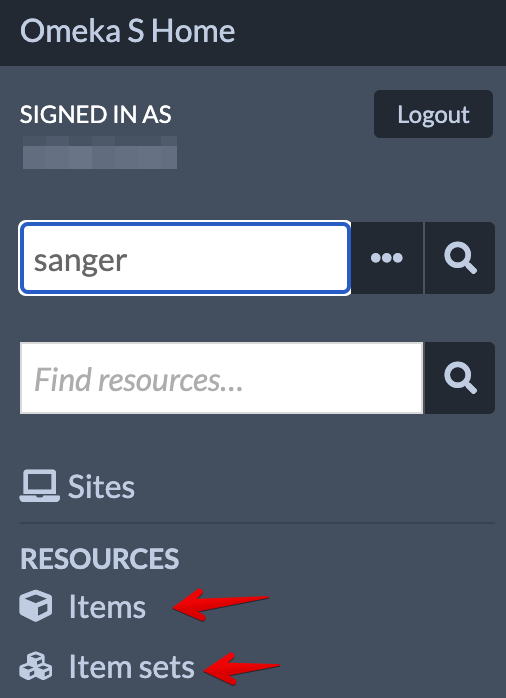
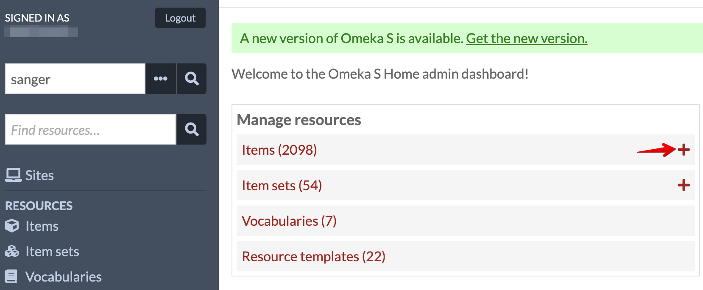

# Omeka S Exhibit Project Homebase for REL 406, Spring 2023

This set of pages is here to guide you through the process of adding the sources you've gathered over the semester, enrich them with metadata, further curate them on pages, and create an inviting and accessible exhibit. Click through the pages using the "Next" button near the bottom right of the page, starting with adding and editing an item.

## Table of Contents

- [Overview of Omeka S](#overview-of-omeka-s)
- [Add Items](#add-items)
- [Add Media](#add-media)

### Overview of Omeka S

1. Go to [https://digitalprojects.davidson.edu/omeka/login](https://digitalprojects.davidson.edu/omeka/login) and log in with your Davidson College email and the password you set before/during class.

*Log in Screen*

2. Click log in and you'll land on the Omeka S homepage. From here, you can . . .

- search all items

*search items*

- view other sites

*view all sites*

- edit the REL 406 site

- view items and item sets

*View items and item sets*

- add new items

*add new item*

### [Add Items](Add_Item.md)

### [Add Media](Add_Alt_Text_Media.md)
