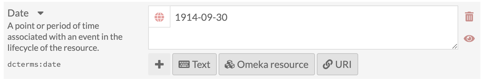
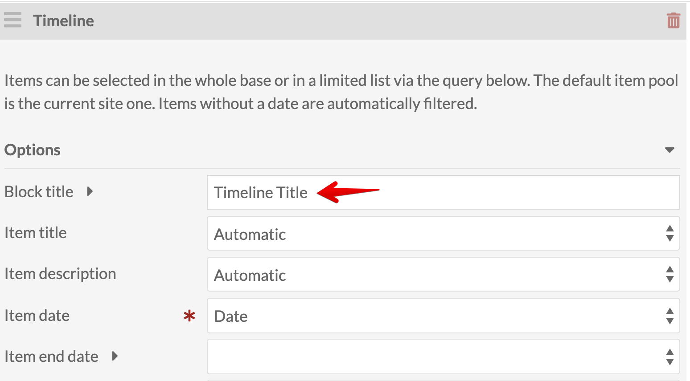
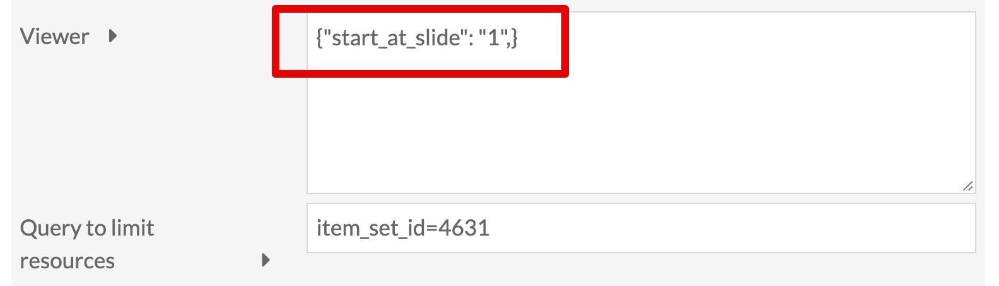
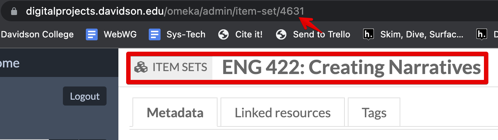
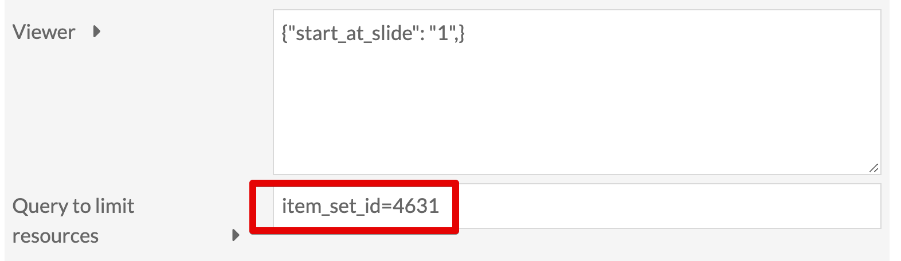
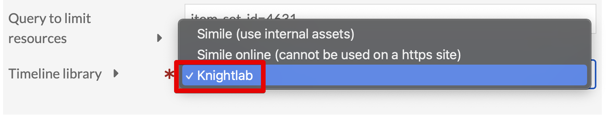
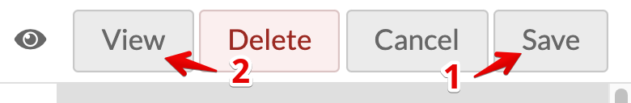

# Add Timeline Data to Items and Add a Timeline Block to a Page
<!-- no toc -->
## Davidson Context
<!-- no toc -->
This page is intended to give guidance on adding timelimes to pages through the Timeline Modules, with Knightlab configurations.

## Overview of Process

- [Date Value in Item](#date-value-in-item)
- [Add Timeline Block to Page](#add-timeline-block-to-page)
  - [Timeline Title](#timeline-title)
  - [Start Timeline at Slide 1](#start-timeline-at-slide-1)
  - [Limit Timeline Resources to Item Set](#limit-timeline-resources-to-item-set)
  - [Set Timeline Library to Knightlab](#set-timeline-library-to-knightlab)
  - [Save and View for Accessibility](#save-and-view-for-accessibility)

___

### Date Value in Item

As long as the item has a date in the dcterms:date value field, that's all that's needed for the Timeline block to work on a page. Use YEAR-MO-DY format for dates. If it only has a year, then put the full four-digit year, e.g., 1976.

*Item Date Format*

### Add Timeline Block to Page

Adding the Timeline block to a page is easy, but there are a few steps to configure it right.

#### Timeline Title

Give it a title to display above the timeline.

*Timeline Title*

#### Start Timeline at Slide 1

In the Viewer value field, enter the following CSS
`{"start_at_slide": "1",}`

Since there's not "title slide" like in standard TimelineJS, starting at slide/item 1 is good practice.

*Viewer options for starting at slide 1*

#### Limit Timeline Resources to Item Set

Click on the Item set to get your unique number from the URL to paste into the Timeline block query. You only need the number after `item-set/`

*Item Set Unique Number for Timeline block query*

The format to put in the Timeline block options is as follows:
`item_set_id=xx`

*Item Set query for Timeline block options*

#### Set Timeline Library to Knightlab

Set the Timeline Library to Knightlab instead of Simile.

*Set Timeline library to Knightlab*

#### Save and View for Accessibility

Save and view to confirm both the item set is being displayed correctly and it's start at the first item in the set (by year).

*Save and View the Page to Verify work*

Run a [WAVE test](https://wave.webaim.org/) to check for missing alt text, or other accessibility errors. If you have 0 errors, "check mark" the appropriate columns in the GSheet tracker.

*Wave Test*

If an item's media is missing a description, then no alt-text will appear and get flagged. Check how to [add media description on my other guide](https://github.com/Davidson-Library/Omeka-S/blob/main/Omeka_S_ENG422_Project.md#add-media-description).
