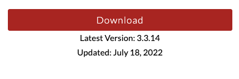
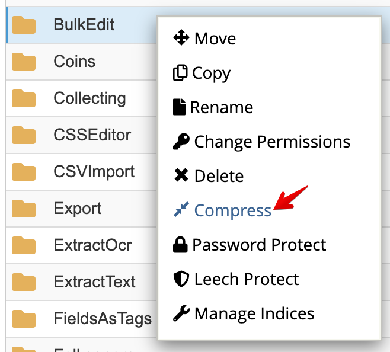
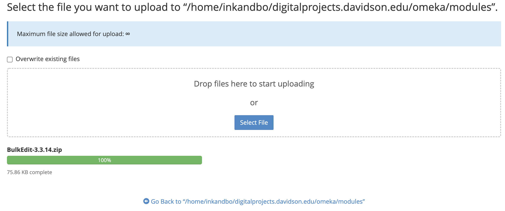
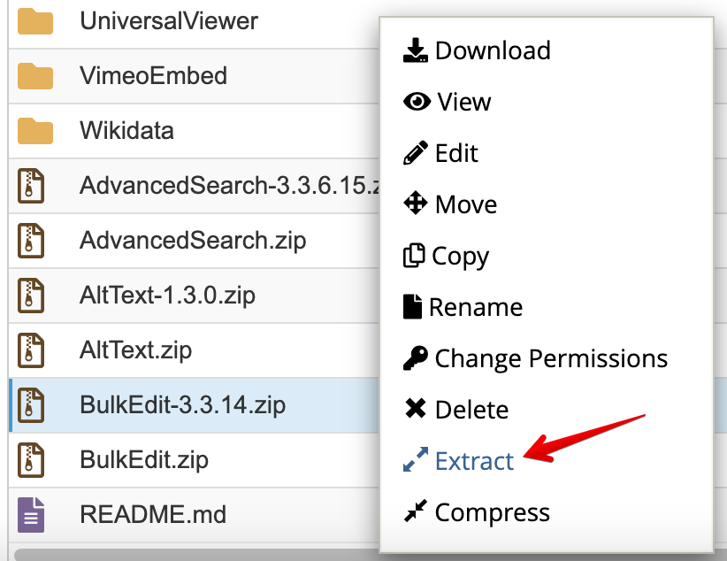
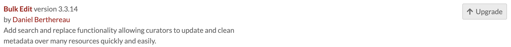

# Updating Omeka S

Updating Omeka S versions was a little tricky last time. There are a couple quirks that take some tinkering.

## Backup and Install New Version

Omeka S has [documentation for updating manually](https://omeka.org/s/docs/user-manual/install/#updating). Before installing, we need to back up.

- Log in to Domains
- Switch to the dogigilearn account
- Switch to inkandbolts cPanel Account
- Open File Manager
- Open digitalproject.davidson.edu folder
- Compress the `omeka` folder as a backup (this takes some time)

While that is zipping, download [Omeka S current release](https://omeka.org/s/download/)

Once the backup zip is complete, I'd recommend downloading it to your local machine as well (just for redundancy). This seems to tie up the cPanel File Manager directories, so grab a cup of ☕ or 🍵 , take a 🙆🏼‍♂️, or go for a short 🚶.

Follow the [Omeka S Updating Doc](https://omeka.org/s/docs/user-manual/install/#updating)
When replacing the files, upload the zip file and unzip it in the directory.

Once the files have been replaced, try accessing "digitalprojects.davidson.edu/omeka/admin
If it gives you an error, try changing the read/write permissions on the files (excluding `.htaccess`) to 644 instead of 664. See this [forum post for more details](https://forum.omeka.org/t/update-to-v-3-0-0-500-internal-server-error/11925/2).

## Module Updating

Check the version in the Omeka S admin/Modules section

Download the new version from the Modules page

Compress the old version in the cPanel as a backup

Click the Upload button and drag+drop the new module zip file.

Extract the newly uploaded zip file.

Refresh the Omeka S admin module page and click the "Upgrade" button for the module.

Repeat these steps for each Module and theme that has an update.

## Check and Verify Sites

Once the update is complete, it's good practice to load each site and test a sampling of pages and items. Different sites use different themes and utilize different modules. If you have any [outstanding forum posts](https://forum.omeka.org/c/omeka-s/8) or [issues in Omeka S's GitHub Repo](https://github.com/omeka/omeka-s/issues), check to see if the update has fixed any issues.
