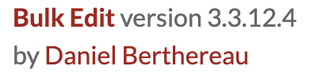
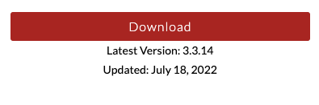
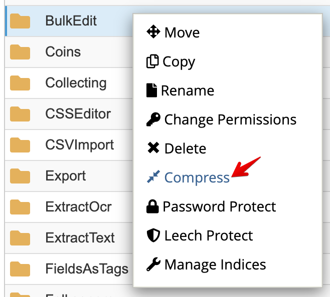
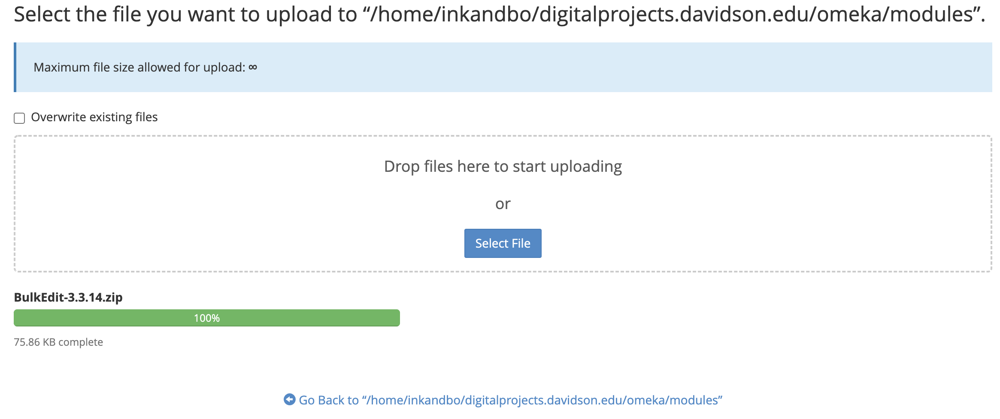
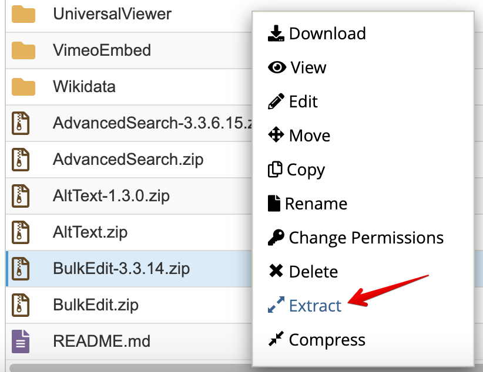
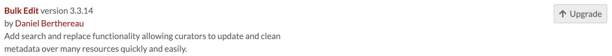

# Updating Omeka S

Updating Omeka S versions was a little tricky last time.

Omeka S has [documentation for updating manually](https://omeka.org/s/docs/user-manual/install/#updating)

Log in to Domains
Switch to the dogigilearn account
Switch to inkandbolts cPanel Account
Open File Manager
Open digitalproject.davidson.edu folder
Compress the `omeka` folder as a backup (this takes some time)

Download [Omeka S current release](https://omeka.org/s/download/)

Once the backup zip is complete, I'd recommend downloading it to your local machine as well. This seems to tie up the cPanel File Manager directories, so grab a cup of ☕ or 🍵 , take a 🙆🏼‍♂️, or go for a short 🚶.

Follow the [Omeka S Updating Doc](https://omeka.org/s/docs/user-manual/install/#updating)
When replacing the files, upload the zip file and unzip it in the directory.

Once the files have been replaced, try accessing "digitalprojects.davidson.edu/omeka/admin
If it gives you an error, try changing the read/write permissions on the files (excluding `.htaccess`) to 644 instead of 664. See this [forum post for more details](https://forum.omeka.org/t/update-to-v-3-0-0-500-internal-server-error/11925/2).

## Module Updating

Check the version in the Omeka S admin/Modules section

Download the new version from the Modules page

Compress the old version in the cPanel as a backup

Click the Upload button and drag+drop the new module zip file.

Extract the newly uploaded zip file.

Refresh the Omeka S admin module page and click the "Upgrade" button for the module.

Repeat these steps for each Module and theme that has an update.
